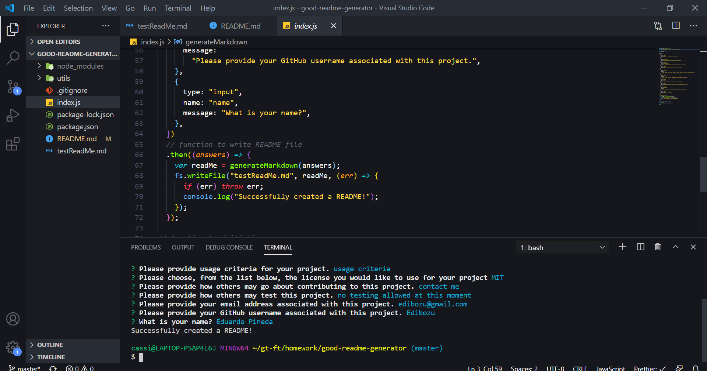
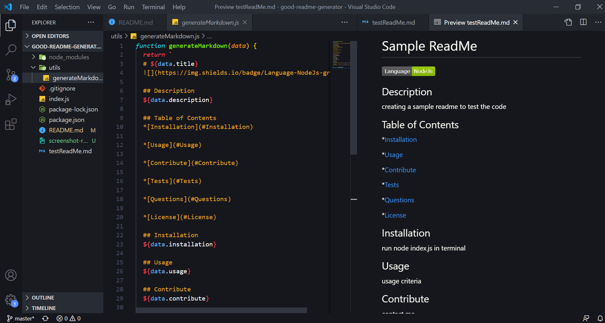

# Good ReadMe Generator

## Description

With this application, the user is able to dynamically create a ReadMe by answering a few simple questions. The code then takes the user's inputs and places them in an organized and formatted template. 

## Installation

The application is found within this repo and can be easily cloned. Next, open file in VS Code, and run `node index.js` within the terminal. This will prompt the questions that the user has to answer, and when completed, a .md file will be created containing the all of the information provided.
   
The screenshot below shows the prompt questions being asked once `node index.js` has been ran inside the terminal.

   
The screenshot below shows the template code where the user's inputs are placed, along with a preview of the ReadMe that was created.

  

## Questions/Contributions

For any questions or contributions, contact me on any of the following links:

Email: edibozu@gmail.com

GitHub Repo: https://github.com/Edibozu/updated-portfolio

LinkedIn: https://www.linkedin.com/in/eduardo-pineda-5595431b6/

## License

MIT License

Copyright (c) [2020] [Eduardo Pineda]

Permission is hereby granted, free of charge, to any person obtaining a copy
of this software and associated documentation files (the "Software"), to deal
in the Software without restriction, including without limitation the rights
to use, copy, modify, merge, publish, distribute, sublicense, and/or sell
copies of the Software, and to permit persons to whom the Software is
furnished to do so, subject to the following conditions:

The above copyright notice and this permission notice shall be included in all
copies or substantial portions of the Software.

THE SOFTWARE IS PROVIDED "AS IS", WITHOUT WARRANTY OF ANY KIND, EXPRESS OR
IMPLIED, INCLUDING BUT NOT LIMITED TO THE WARRANTIES OF MERCHANTABILITY,
FITNESS FOR A PARTICULAR PURPOSE AND NONINFRINGEMENT. IN NO EVENT SHALL THE
AUTHORS OR COPYRIGHT HOLDERS BE LIABLE FOR ANY CLAIM, DAMAGES OR OTHER
LIABILITY, WHETHER IN AN ACTION OF CONTRACT, TORT OR OTHERWISE, ARISING FROM,
OUT OF OR IN CONNECTION WITH THE SOFTWARE OR THE USE OR OTHER DEALINGS IN THE
SOFTWARE.

